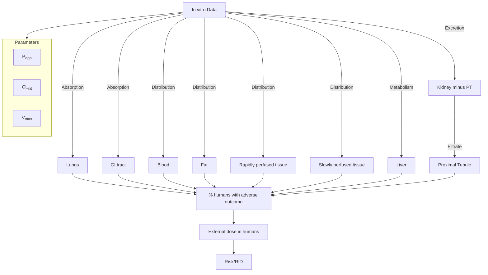

## A method description for slide 

Via GPT-4o:

PROMPT - AI response:

Me: Convert the diagram that depicts a PBPK model to mermaid syntax.

ChatGPT:
To convert the diagram depicting a PBPK (Physiologically Based Pharmacokinetic) model to mermaid syntax, we need to create a flowchart that illustrates the key elements and connections shown in the image.

Here's the mermaid code for the PBPK model based on the provided diagram:

