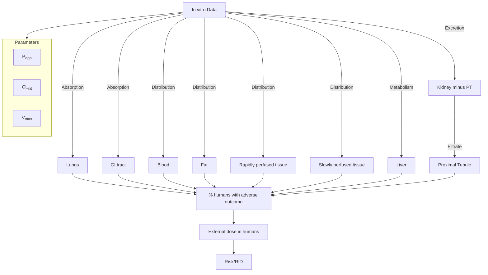

## A method description for slide 

```mermaid

graph TD
    A[In vitro Data] -->|Absorption| B1[Lungs]
    A -->|Absorption| B2[GI tract]
    A -->|Distribution| C1[Blood]
    A -->|Distribution| C2[Fat]
    A -->|Distribution| C3[Rapidly perfused tissue]


    A -->|Distribution| C4[Slowly perfused tissue]
    A -->|Metabolism| D1[Liver]
    A -->|Excretion| E1[Kidney minus PT]
    E1 -->|Filtrate| E2[Proximal Tubule]
    
    B1 --> F[% humans with adverse outcome]
    B2 --> F
    C1 --> F
    C2 --> F
    C3 --> F
    C4 --> F
    D1 --> F
    E2 --> F
    
    F --> G[External dose in humans]
    G --> H[Risk/RfD]

    %% Additional parameters
    subgraph Parameters
        Papp[P<sub>app</sub>]
        CLint[CL<sub>int</sub>]
        Vmax[V<sub>max</sub>]
    end
    
    A --> Parameters

```
